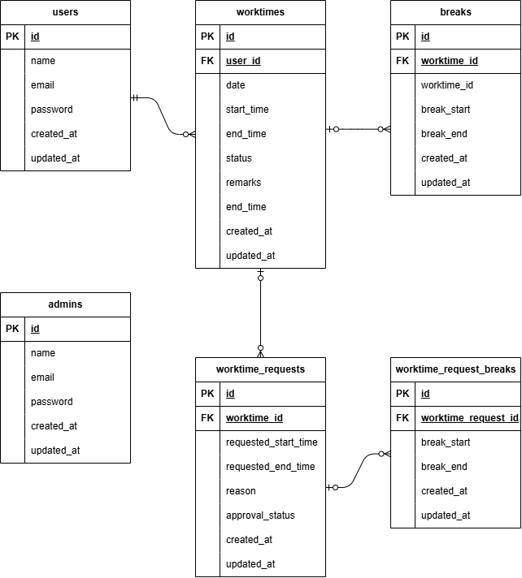

# attendance-management-appli

# 環境構築

**Docker ビルド**

1. `git clone git@github.com:d1305hira/attendance-management-appli.git`
2. DockerDesktop を起動
3. `docker-compose up -d --build`

**Laravel 環境構築**

1. `docker-compose exec php bash`
2. `composer install`
3. `.env` に以下を設定

```text
DB_CONNECTION=mysql
DB_HOST=mysql
DB_PORT=3306
DB_DATABASE=laravel_db
DB_USERNAME=laravel_user
DB_PASSWORD=laravel_pass
```

4. アプリケーションキーの作成

```bash
php artisan key:generate
```

5. マイグレーションの実行

```bash
php artisan migrate
```

6. シーディングの実行

```bash
php artisan db:seed
```

## PHPUnit を利用したテストに関して

以下のコマンド:

1. 'cp .env .env.testing'

```text
DB_CONNECTION=mysql
DB_HOST=mysql
DB_PORT=3306
DB_DATABASE=test_database
DB_USERNAME=laravel_user
DB_PASSWORD=laravel_pass
```

2. 'docker-compose exec mysql bash'
3. 'mysql -u root -p' //パスワードは root と入力
4. 'create database test_database'
5. 'docker-compose exec php bash'
6. 'php artisan migrate:fresh --env=testing'
   ./vendor/bin/phpunit

## 使用技術（実行環境）

- PHP 8.3.x
- Laravel 8.75+
- MySQL 8.x

## ER 図



## URL

- 開発環境：http://localhost/
- phpMyAdmin:：http://localhost:8080/
